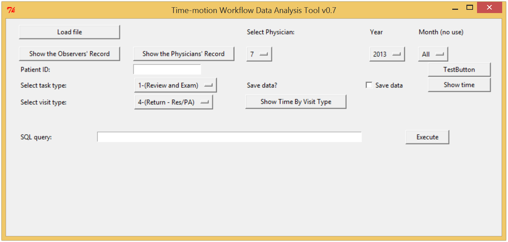

This codebook will show the instruction of how to use the GUI.

# system requirement
The OS I used mostly is Windows 8, but the program works on Mac OS too.
You need to install Python if using a Windows PC. Mac PC comes with Python installed. I used Python 2.7.9.

The Python libraries required are:
```
pylab
numpy
matplotlib
Tkinter
sqlite3
```

# The layout #


