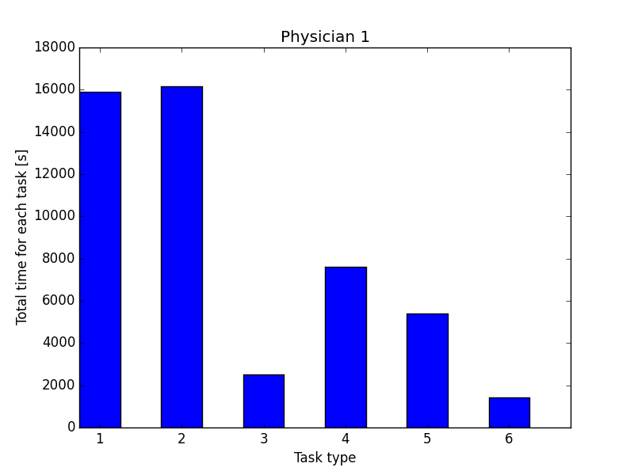
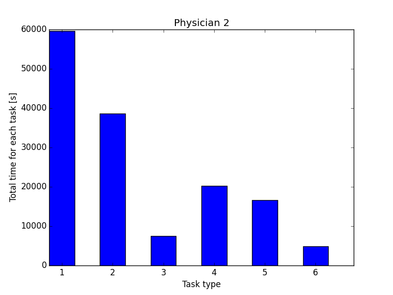
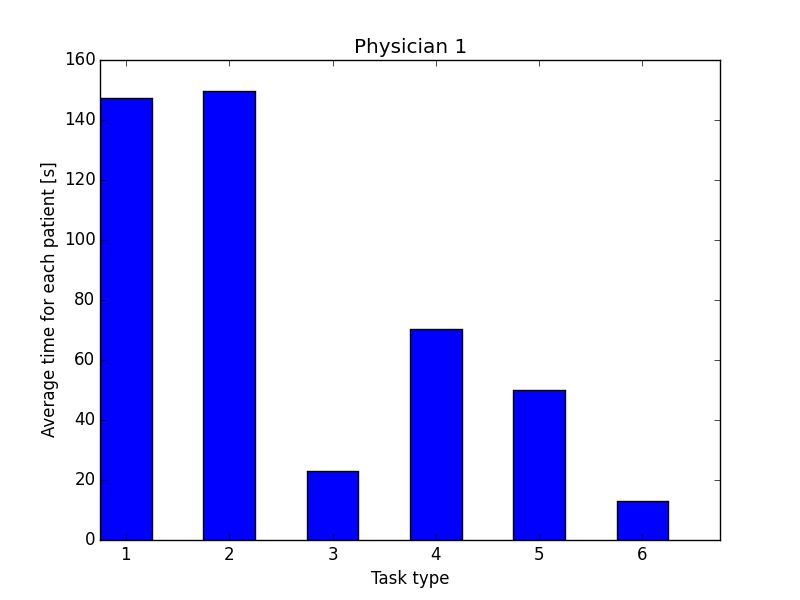
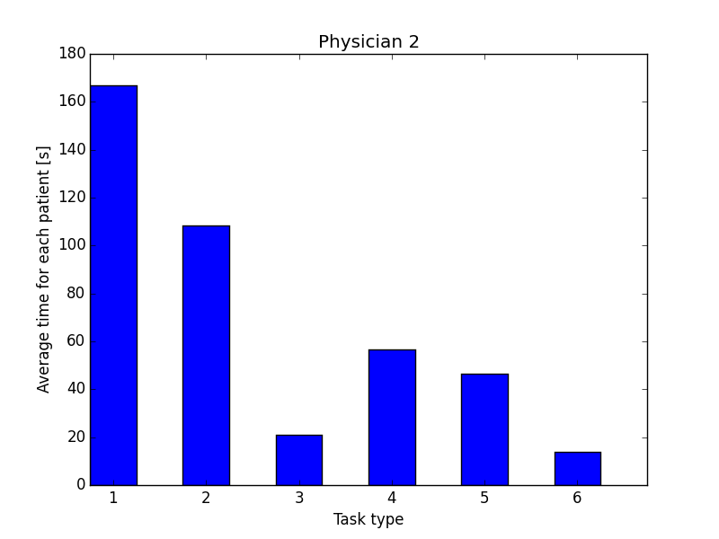
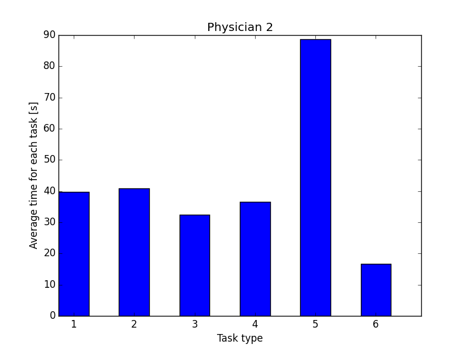

# TimeMotionGUI

GUI for Time Motion Workflow Data Analysis, to visualize changes in orthopaedic clinic workflow with the implementation of electronic medical record, for University of Arizona Medical Center - Tucson.

# History:

v0.3 added the function to plot the time for individual patient; added the function to plot the time spent by individual physicians; removed the canvas (for now); user can execute SQL query now. Goal for v0.4: to sort time spent by visit type, and year; improve the way to make plots.

v0.2 rewrote all the button commands. changed the whole layout. (label text works under windows but shows irregular under mac)

v0.1 added first the function of show the records for observers and physicians. added basic layout.

# Introduction

We want to document the time spent for patients' visit after the implementation of electronic medical record (EMR). Student volunteers were recruited to follow physicians during patients’ visit, and record the time spend for each task.

The data are in SQL format, and contain several tables: The session table includes session IDs, physician names, and visit types. The patient table includes patient information. The task table includes the start time and end time for each task for each patient’s visit.

For example, during a patient’s visit, the time spent is as following:

There are 6 different task types, such as physical exam, discussion, and recording. 

The following 2 plots shows the total time* spent by two different physicians during the past 3 years (next version of the GUI will add the function to split the time by year):

(* the total time corresponds to only the time when the physician was followed by student volunteers, not the actually time spent by the physician.)

Although the total time are very different, the average time the physician spent on each patient are very similar:

Another very important information is the average time spent by each physician for each task:

# What’s next

There are still quite a lot analysis to do, lots of features to be added to the GUI.
