# TimeMotionGUI

GUI for Time Motion Workflow Data Analysis, to visualize changes in orthopaedic clinic workflow with the implementation of electronic medical record, for University of Arizona Medical Center - Tucson.

# History:
v0.7 added the feature to plot time sorted by visit types (with its own execute button); now most of the required features have been added, next task would be to rewrite the program to improve its efficiency and readability (there are quite a lot of repeating lines, and maybe I can use more sophisticated SQL query). 

v0.6 changed the layout; added the function to plot time sorted by task types; added xkcd-style for plots; next task would be sorting by the visit types.

v0.5 (and 0.4) added the function to plot time for each physician, for all time or certain year; improved the way to make plots (now three plots in one figure); also added the button to choose the sqlite file.

v0.3 added the function to plot the time for individual patient; added the function to plot the time spent by individual physicians; removed the canvas (for now); user can execute SQL query now. Goal for v0.4: to sort time spent by visit type, and year; improve the way to make plots.

v0.2 rewrote all the button commands. changed the whole layout. (label text works under windows but shows irregular under mac)

v0.1 added first the function of show the records for observers and physicians. added basic layout.

# Introduction

We want to document the time spent for patients' visit after the implementation of electronic medical record (EMR). Student volunteers were recruited to follow physicians during patients’ visit, and record the time spend for each task.

The data are in SQLite format, and contain several tables: The session table includes session IDs, physician names, and visit types. The patient table includes patient information. The task table includes the start time and end time for each task for each patient’s visit.

## Summary of one patient and total appearance of all the physicians ## 
For example, during a patient’s visit, the time spent is as following:
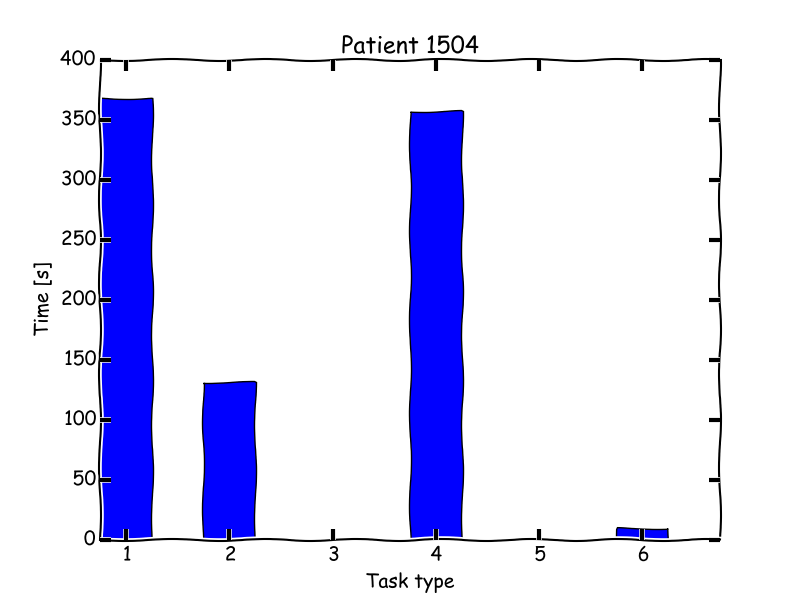
(More examples can be found under /Plots/Patient/)

The next figure shows how many sessions were record from different physicians:
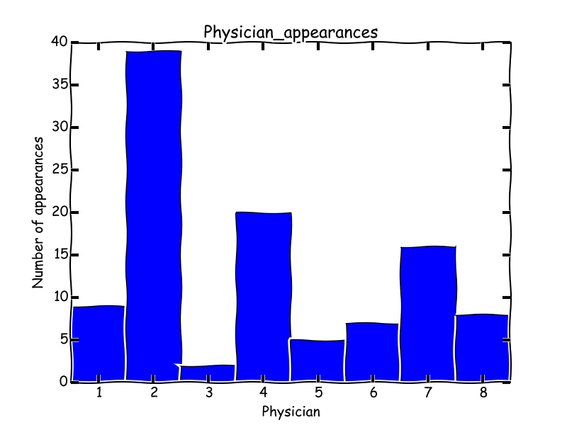
The physicians were numbered as 1-8, instead of their real names here.

## Record of one physician in 3 year ##
The following figure shows the time spent by physician #7 during the past 3 years:
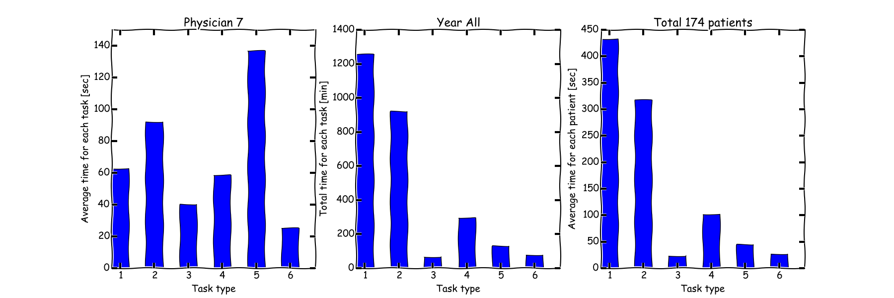
The three subplots are the average time the physician spent for each task, the total time* he spent for each task, and the average time he spent for one patient.

(* the total time corresponds to only the time when the physician was followed by student volunteers, not the actually time spent by the physician.)

The time spent for each year (2013, 2014 and 2015) are as following:
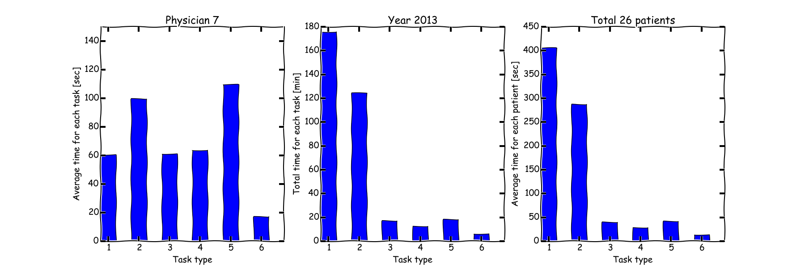
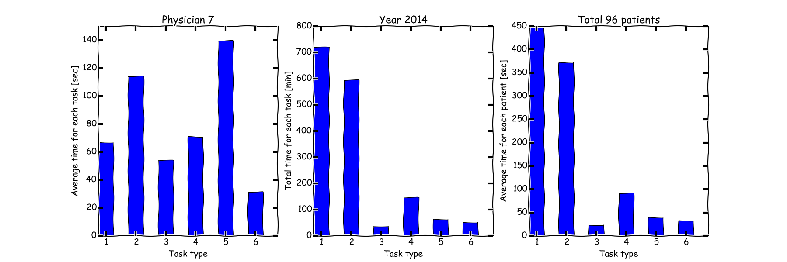
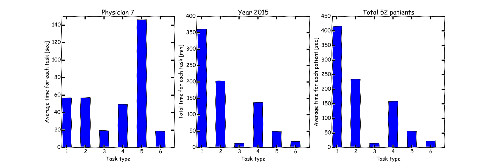

## Time sorted by task type.
There are 6 different task types, such as physical exam, discussion, and recording. For each task type, there are also several sub types.

For the physician above, the time he spent can be sorted by each task type. For example, task type 1:
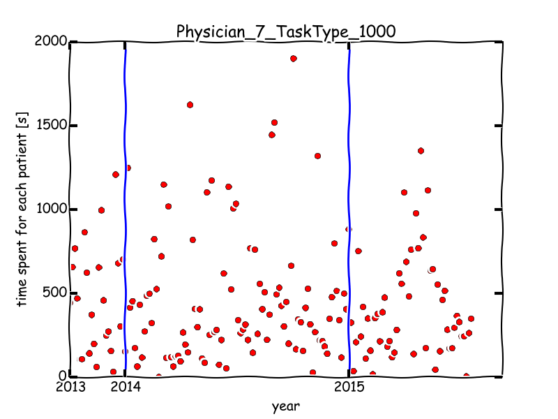

The median value for each year:
```
2013: 444 sec
2014: 341 sec
2015: 341 sec
```

Task type 2:
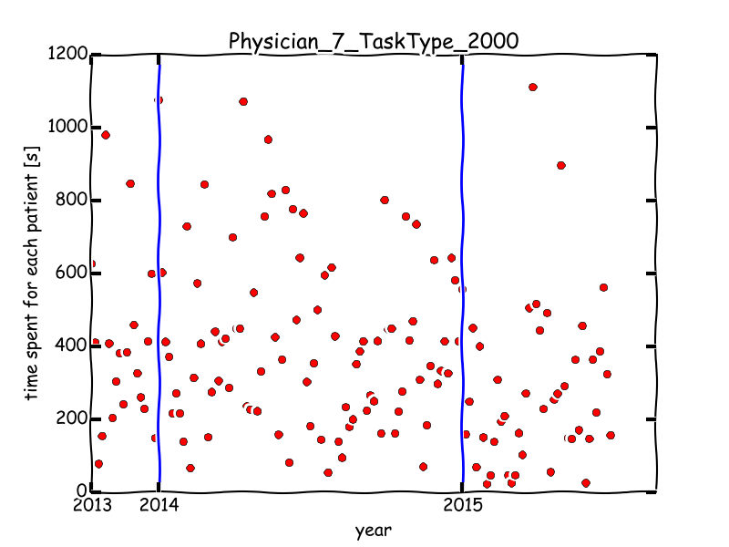

The median value for each year:
```
2013: 382 sec
2014: 380 sec
2015: 229 sec
```
More plots can be found under folder Plots/By_task_type/. It seems the median time spent for each task is decreasing for most task types.

The time spent for sub task types can also be plot, for example:
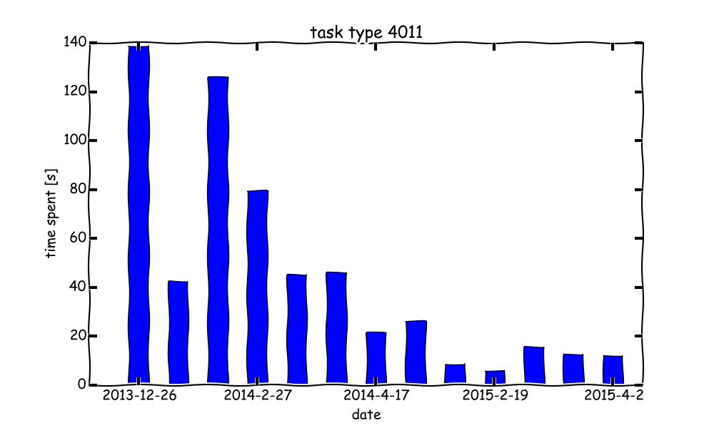

More plots for type 4 task can be found under the folder Plots/By_task_type/.


## Time sorted by visit type ##
There are also 6 different visiting type, such as new patient, return patient. It is also important to be able to sort the time by different visiting type.

For the same physician above, the time he spent with patients of one certain visit type (also type 1 task) can be shown as following:
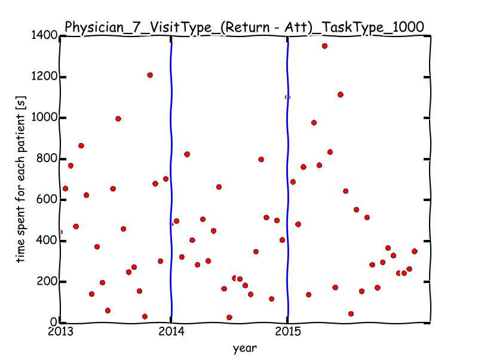

The median value for each year:
```
2013: 460 sec
2014: 377 sec
2015: 367 sec
```

Similarly, the time he spend for each sub task type can be plot, for example:
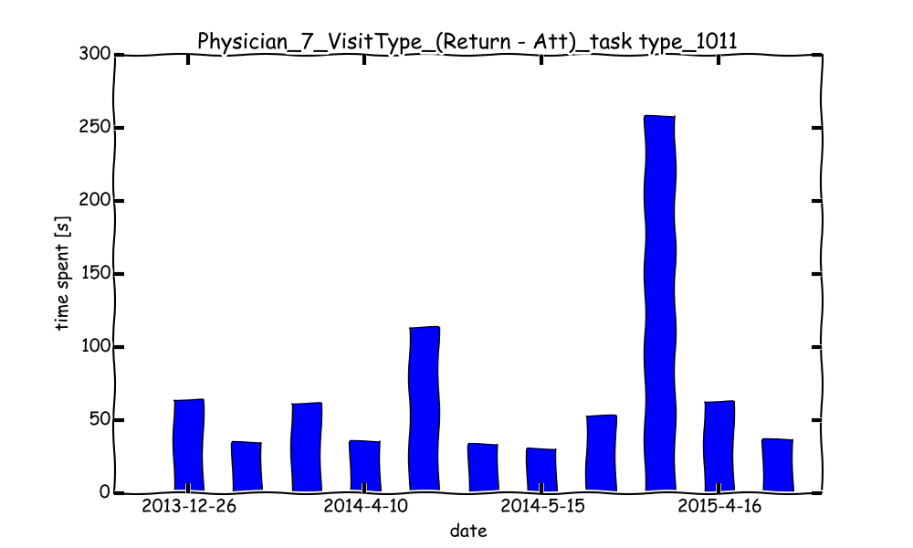

More plots for type 4 task can be found under the folder Plots/By_visit_type/.

# What’s next

Next would be to improve the efficiency and readability of the code.
